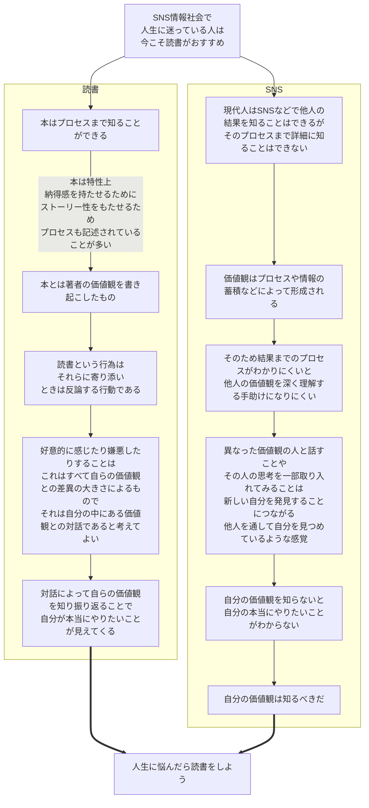

# 内容整理

# MEMO
- 他人の価値観を知ることによる、自分への効果
異なった価値観の人と話すことや その人の思考を一部取り入れてみることは 新しい自分を発見することにつながる
他人を通して自分を見つめているような感覚です。
「この人は、こう考えてるんだ。じゃあ、自分はどうなんだろう？」
自分だけで考えている時とは、違う考え方をすることができたりもします。
「この人の意見と、自分の意見は違うな」と思ったとしても、「違う」ということがわかっただけで十分なのです。

＝＝＝＝＝＝＝＝＝＝＝＝＝＝＝＝＝＝＝＝＝＝＝＝＝＝＝＝＝＝＝＝＝＝＝＝＝＝＝＝

# テーマ「読書」

### あなたにとって「読書」とは？
